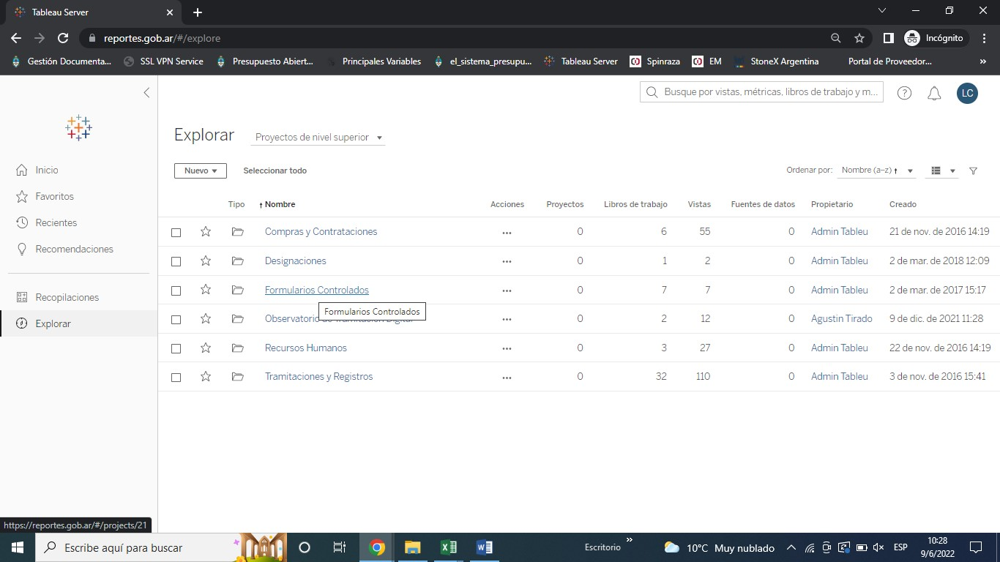

# Tablero-Expediente de pago a proveedpores
Seguimiento de expedientes que tramitan facturas

# Objetivos y alcances:

En el armado de este tablero participó la Dirección de Innovación Administrativa a través de la obtención de distintos formularios controlados obtenidos del GDE y de la recaudación de los trámites a distancia (TAD) para el pago de facturas de proveedores del Ministerio de Salud. 
Las áreas involucradas y destinatarias son aquellas con el interés de visualizar los expedientes abiertos de pago a proveedores. La aprobación de este tablero fue llevada a cabo por la Secretaría de Gestión Administrativo con el fin de visibilizar y trasparentar tanto los tiempos y la cantidad de expedientes, como así también el monto total de las facturas a devengar. Esto permite tener información clara para las distintas áreas del ministerio como para el análisis de comparación con otros ministerios. 

El tablero tiene como objetivo revelar ciertos indicadores importantes y que funcione como repositorio de información sobre los expedientes que se inician por TAD para el pago a proveedores. Para tal fin se hace una actualización semanal, que será estipulado un día fijo. No están incluidos en este tablero aquellos expedientes que ya fueron devengados y cerrados. 

El tablero visualiza indicadores que refieren el importe según la ubicación de los expedientes; el importe según el sistema de origen de pago; el estado de los expedientes; la cantidad de expedientes por estado; los proveedores con mayor importe de facturas.
Además, permite el alcance a una tabla que resume según la repartición donde se ubica el expediente, la cantidad de facturas que tiene esa área, el promedio de días del último pase y el monto total de las facturas. 
Por último, le sigue una pestaña en el que está el listado completo de expedientes abiertos que tramitan el pago de facturas a proveedores.

# Descripción de informes fuente

El tablero de Expedientes de pago a proveedores se construye con cuatro informes de Tableau:
1. Comprobantes para autogestión de proveedores
2. Presentación de facturas Adquisiciones con Financiamiento Internacional
3. Presentación de facturas no amparadas por proceso de compra
4. Detalle de expedientes GDE – Expedientes electrónicos
5. Documentos asociados a expedientes

Los informes **Comprobantes para autogestión de proveedores**, **Presentación de facturas Adquisiciones con Financiamiento Internacional** y **Presentación de facturas no amparadas por proceso de compra** se encuentran dentro de la carpeta Formularios Controlados. Para acceder a dicha carpeta, ingresar al [tableau](https://reportes.gob.ar) con usuario y contraseña y dentro del menú Explorar, seleccionar la carpeta Formularios Controlados, tal como se muestra en la **Ilustración 1**.

**Ilustración 1 - Menú explorar**

